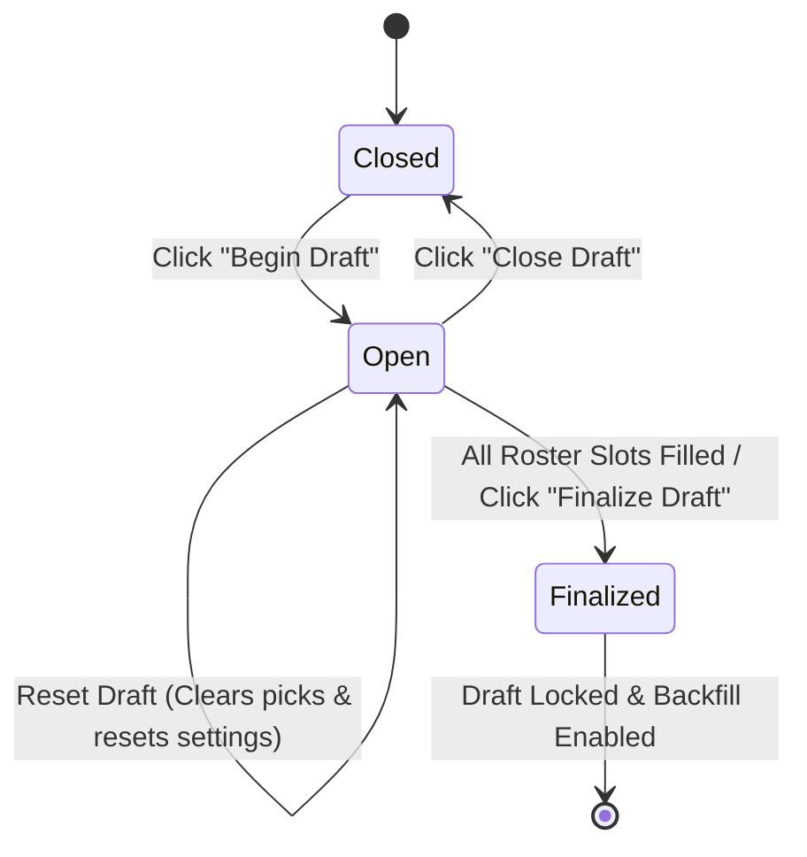

# Product Requirements Document (PRD): Survivor Fantasy League Draft System

**Version**: 1.1 (Finalized Design)  
**Status**: Approved Specification  
**Location**: `features/draft_prd.md`  
**Target Page**: `draft.html` (Draft Board & Player Roster)

---

## 1. Overview & Objectives

The **Draft System** transforms the player selection process into an interactive, configurable, and automated fantasy draft experience for Survivor fantasy leagues.

Key capabilities:
- **Draft Status State Machine**: `Closed` ➔ `Open` ➔ `Finalized`.
- **Dynamic Draft Styles**: Linear, Snake, and Auction drafts (plus custom recommendations like *Derby/Picker's Choice*).
- **Intelligent Draft Orders**: Pure Random or Based on Previous Season (Reverse Standings with individual immunity tie-breakers).
- **"The Voting Booth" Draft Order Box & Pick Timer**: Titled **"The Voting Booth"**, this live tracker displays manager order sequence with a **burning torch icon (🔥)** on the active drafting manager, current pick, round, on-the-clock highlight, and a **pick timer (`⏱️ 0:00`)** tracking elapsed time since the last pick.
- **Safety Safeguards & Soft Resets**: Protects active drafts from accidental setting changes with explicit warnings and full reset options.
- **Post-Draft Backfill Automation**: Automatically assigns leftover unassigned players (by lowest Cast ID) when drafted contestants are eliminated.
- **Firebase Realtime Synchronization**: Synchronizes picks, turns, timers, and draft state across all connected league managers in real-time.

---

## 2. Draft Status State Machine



### State Definitions & Behavior

| Feature / UI Element | `Closed` State | `Open` State | `Finalized` State |
| :--- | :--- | :--- | :--- |
| **Assign Buttons on Player Cards** | Hidden / Disabled | **Active** for On-the-Clock turn | **Removed** |
| **The Voting Booth & Pick Timer** | Hidden | **Visible** (`⏱️ 0:00` timer restarts on each pick, torch icon on active manager) | Hidden (Replaced by Final Roster view) |
| **Header Primary Action** | `🔥 Begin Draft` button | `🔴 Close Draft` & `🏆 Finalize Draft` buttons | `🔒 Draft Finalized` badge |
| **Settings Cog** | **Editable** (No warning if 0 picks) | **Protected** (Requires confirmation warning to edit/reset) | **Locked** (Read-only review) |
| **Unassigned Player Pool** | Visible | Visible | **Removed / Hidden** (Stored for Backfill) |
| **Backfill Engine** | Inactive | Inactive | **Active** (Triggers on player elimination) |

---

## 3. Comprehensive Feature Specifications

### 3.1 Draft Status & Header Bar
- Located prominently above the main title on `draft.html`.
- Displays current state pill (`CLOSED`, `OPEN`, `FINALIZED`).
- Primary Control Buttons:
  - When `Closed`: Displays prominent **"🔥 Begin Draft"** button.
  - When `Open`: Displays **"🔴 Close Draft"** button and **"✅ Finalize Draft"** button (enabled when teams meet min roster capacity).
  - When `Finalized`: Displays **"🔒 Draft Finalized"** badge.

### 3.2 "The Voting Booth" Draft Order Box & Pick Timer
- Appears above the player cards grid whenever draft status is `Open`.
- **Title**: Prominently displays **"🗳️ THE VOTING BOOTH"**.
- **Content & Functionality**:
  - Current Round & Pick Number (e.g., `Round 2 • Pick 3 (Overall #10)`).
  - **Pick Timer (`⏱️ 0:00`)**: Digital timer tracking elapsed time since the last pick was made. Restarts at `0:00` immediately whenever a pick occurs.
  - Horizontal scrolling list of managers in draft sequence order.
  - **Torch Icon (🔥)**: Displayed prominently beside the manager currently on the clock, accompanied by a glowing amber border and pulse animation (`TORCH LIT`).

### 3.3 Draft Settings Drawer / Modal
Accessible via the **⚙️ Settings Cog** next to the View Mode toggles.

#### A. Draft Order Selection
1. **Random (Default)**:
   - Randomly shuffles the league managers into a drafting sequence.
   - *Description*: *"Managers are placed in a completely random draft order."*
2. **Based on Previous (Reverse Standings)**:
   - *Description*: *"Draft order goes from lowest to highest points from the previous season (e.g. Season 50). If managers tied in points, tie is broken by most individual immunities won by players on their roster in that season. New managers are placed randomly behind returning managers."*
   - **Disabled State**: If no previous season exists for the active league, this radio option is greyed out with the notice:  
     `"Based on Previous - Must Have Played More Than One Season to Enable This"`

#### B. Draft Style Selection
1. **Linear Draft**:
   - Order remains constant every round (`1 ➔ 2 ➔ 3 ➔ 4`, `1 ➔ 2 ➔ 3 ➔ 4`).
2. **Snake Draft**:
   - Order reverses every alternating round (`1 ➔ 2 ➔ 3 ➔ 4`, `4 ➔ 3 ➔ 2 ➔ 1`, `1 ➔ 2 ➔ 3 ➔ 4`).
3. **Auction Draft**:
   - Each manager receives a virtual budget (default: `$100`).
   - Managers take turns nominating a player.
   - Dedicated **Auction Podium Modal** displays budget counters (`$100 remaining`) for each team, active nomination, and `$1` increment bidding.
4. **💡 Recommended Style — Derby / Picker's Choice**:
   - Managers are randomly drawn to choose their preferred draft slot position (`1st`, `2nd`, `3rd`, etc.) before the main draft begins!

#### C. Backfill Setting
- **Toggle Switch**: `Automatically Backfill Eliminated Players` (Default: **ON**).
- **Behavior**: If unassigned players remain when the draft is `Finalized`, whenever an active contestant is voted out or eliminated, the unassigned player with the **lowest Cast ID** automatically fills the vacated roster slot.

---

## 4. Draft Modification & Safety Reset Safeguards

To prevent accidental draft disruption:

```
[User clicks Settings Cog when Draft is Open & Picks > 0]
                       │
                       ▼
┌────────────────────────────────────────────────────────┐
│ ⚠️ WARNING: DRAFT IN PROGRESS                          │
│                                                        │
│ 1 or more players have already been drafted.           │
│ Changing draft settings requires completely resetting  │
│ the active draft and clearing all picks.               │
│                                                        │
│ Do you wish to reset the active draft?                 │
│                                                        │
│ [ 🚫 Cancel & Resume Draft ]  [ 🔄 Reset & Edit ]     │
└────────────────────────────────────────────────────────┘
```

- **0 Picks Drafted**: Settings can be modified and saved freely without resetting.
- **≥ 1 Picks Drafted**:
  - Clicking `Cancel` aborts setting changes and leaves the active draft untouched.
  - Clicking `Reset & Edit Draft` clears all assigned picks, resets pick pointer to `Round 1, Pick 1`, transitions draft status to `Closed`, and opens settings modal.

---

## 5. Realtime Firebase Data Schema

```json
{
  "leagues": {
    "jordan-denver-league": {
      "seasons": {
        "season-51": {
          "draftState": {
            "status": "closed",
            "style": "snake",
            "orderType": "random",
            "backfillEnabled": true,
            "currentRound": 1,
            "currentPick": 1,
            "lastPickTimestamp": 1727040000000,
            "onTheClockTeamId": "ryan",
            "orderSequence": ["ryan", "jordan", "scott", "hayley", "ashlynn"],
            "budgets": {
              "ryan": 100,
              "jordan": 100
            }
          }
        }
      }
    }
  }
}
```

---

## 6. Verification & Implementation Plan

1. **State Machine Verification**:
   - Test `Closed` ➔ `Open` ➔ `Finalized` transitions.
   - Verify `Close Draft` button behavior when draft is active.
2. **Draft Order & Tie-Breaker Verification**:
   - Test `Random` shuffling vs. `Based on Previous` reverse standings.
   - Verify individual immunity tie-breaker calculation and disabled state notice.
3. **Pick Timer Verification**:
   - Confirm `⏱️ 0:00` pick timer counts up and resets to `0:00` on each pick.
4. **Backfill Verification**:
   - Verify lowest Cast ID priority assignment when an eliminated player is logged post-finalization.
5. **Reset Safeguard Verification**:
   - Attempt settings modification mid-draft (≥1 pick) and confirm Warning Modal prompt and reset behavior.
