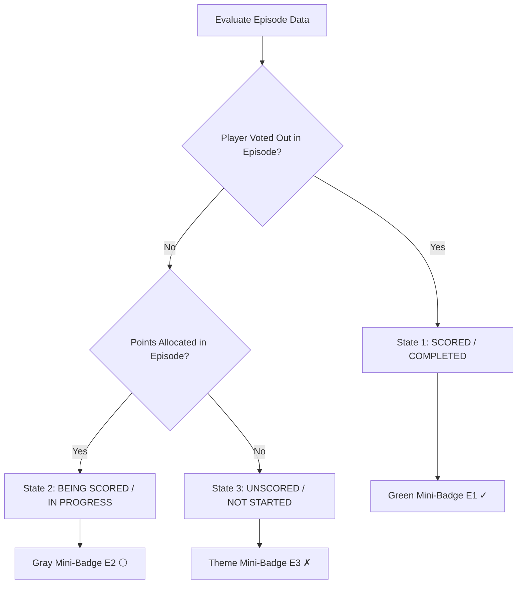

# Product Requirements Document (PRD): Episode Memory & "Episodes Scored" Tracker

**Version**: 1.3 (Updated with Compact Bar Layout & 3-State Tracker)  
**Status**: Approved Specification  
**Location**: `features/episode_scoring_tracker/episode_scoring_tracker_prd.md`  
**Target Pages**: `index.html` (Leaderboard & Scoring Modal), `draft.html` (Draft Board / Points Entry)  
**Git Branch**: `feature/episode-scoring-tracker`

---

## 1. Overview & Objectives

The **Episode Memory & "Episodes Scored" Tracker** feature enhances the scorekeeping workflow and overall league visibility for the Survivor Fantasy League.

### Core Objectives:
1. **Top-Level Episode Selection & Auto-Memory**:
   - Re-position the **Episode Select** dropdown to the **very top** of the `Add Points` modal form for intuitive top-down scoring entry.
   - Automatically remember the last episode selected by the user in `localStorage`.
   - Pre-fill the last selected episode automatically when the modal opens and retain the selection after submitting points to streamline bulk score entry.
2. **Compact 3-State "Episodes Scored" Leaderboard Tracker**:
   - Display a sleek, non-intrusive horizontal status toolbar directly above the main Leaderboard section (`index.html`).
   - Designed to be a **minor, compact accent UI element** (~40px height) rather than dominating screen real estate.
   - Displays micro-badges (`E1 ✓`, `E2 ⚪`, `E3 ✗`, ..., `E14 ✗`) supporting 3 states:
     - **Scored / Completed**: Emerald green mini-badge with check mark (`✓`) when a player has been voted out / eliminated in that episode.
     - **Being Scored / In Progress**: Slate gray mini-badge with circle (`⚪`) when points have been allocated under that episode but no player has been voted out yet.
     - **Unscored / Not Started**: Theme dark/amber mini-badge with X mark (`✗`) when 0 points and 0 eliminations exist.

---

## 2. Feature Specifications

### 2.1 Form Re-Ordering & Last Selected Episode Memory (`Add Points` Modal)

#### A. Form Layout (Episode Select at the Top)
The form order inside the `Add Points` modal is structured as follows:
1. 🔝 **Episode Number (`#episode-select`)**: Placed at the **very top** of the modal form.
2. 👤 **Player Selection (`#player-select`)**
3. 🏷️ **Scoring Category Search & Select (`#category-select`)**
4. 🔢 **Points Input (`#points-input`)**
5. 📝 **Note Input (`#note-input`)**

#### B. Behavior & Persistence
- **LocalStorage Key**: `survivor_last_selected_episode`.
- **Initialization**:
  - When the `Add Points` modal opens, `#episode-select` automatically loads the saved episode string from `localStorage`.
  - If no saved value exists, it defaults to the first episode (`1`) or blank prompt (`Choose episode...`).
- **User Selection Sync**:
  - Changing the episode dropdown immediately updates `localStorage.setItem('survivor_last_selected_episode', selectedVal)`.
- **Post-Submission Behavior**:
  - Upon successful score submission, the modal resets `#player-select`, `#category-select`, `#points-input`, and `#note-input`, but **retains** the `#episode-select` value to allow fast consecutive entry for the same episode.

---

### 2.2 Compact 3-State "Episodes Scored" Leaderboard Tracker

#### A. Visual Placement & Layout
- Located directly above the main Leaderboard section on `index.html`.
- Rendered as a single, sleek horizontal toolbar (`py-3 px-4`, rounded-xl) that sits unobtrusively above the content.
- Takes up minimal vertical space (~40px) to serve as a clean UI status indicator without cluttering the screen.

#### B. 3 Episode Box States & Styling



| Episode State | Icon | State Condition | Compact Badge Styling |
| :--- | :--- | :--- | :--- |
| **Scored / Completed** | `✓` | Player marked Voted Out / Eliminated in this episode | Green pill: `px-2 py-1 bg-emerald-950/80 border-emerald-500/70 text-emerald-300` |
| **Being Scored / In Progress** | `⚪` | Points allocated under this episode, BUT no player voted out yet | Slate gray pill: `px-2 py-1 bg-slate-800/90 border-slate-400/70 text-slate-200` |
| **Unscored / Not Started** | `✗` | 0 points allocated AND no player voted out in this episode | Dark wood pill: `px-2 py-1 bg-amber-950/20 border-amber-900/40 text-amber-300/40` |

#### C. Interactive Enhancements
- **Click to Pre-fill**: Clicking any episode mini-badge opens the `Add Points` modal with that episode pre-selected.

---

## 3. Data Schema & Computation

### 3.1 3-State Episode Determination Algorithm
For each episode $E \in \{1, 2, \dots, 14\}$:

$$\text{EpisodeState}(E) = \begin{cases} 
\mathbf{Scored} & \text{if } \exists \text{ player } P \text{ s.t. } \text{eliminationOrder}[P] = E \\ 
\mathbf{BeingScored} & \text{else if } \exists \text{ player } P, \text{ scoreId } S \text{ s.t. } \text{scores}[P][E][S] \text{ exists} \\ 
\mathbf{Unscored} & \text{otherwise} 
\end{cases}$$

---

## 4. Visual Wireframe

```
┌─────────────────────────────────────────────────────────────────────────────────────────────────┐
│ 📺 EPISODES SCORED: [E1 ✓]  [E2 ✓]  [E3 ⚪]  [E4 ✗]  [E5 ✗]  [E6 ✗] ... [E14 ✗]                  │
└─────────────────────────────────────────────────────────────────────────────────────────────────┘
```

---

## 5. Verification & Testing Plan

1. **Branch Verification**:
   - Ensure work is conducted on `feature/episode-scoring-tracker`.
2. **Compact Bar Layout Verification**:
   - Confirm tracker renders as a sleek, minor toolbar header instead of a large grid box.
3. **Add Points Form Layout**:
   - Confirm `#episode-select` is rendered at the very top of the modal form above `#player-select`.
4. **Episode Auto-Memory**:
   - Open `Add Points` modal, select `Episode 3`, and submit points.
   - Confirm `#episode-select` retains `Episode 3`.
5. **3-State Tracker Behavior**:
   - **Completed (`✓`)**: Mark a player voted out in Episode 1: verify E1 turns green with `✓`.
   - **Being Scored (`⚪`)**: Log points in Episode 3 without a voted-out player: verify E3 turns gray with `⚪`.
   - **Unscored (`✗`)**: Episodes with 0 points and 0 eliminations display themed dark/amber `E# ✗`.
