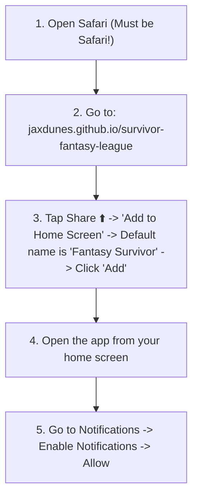

# Product Requirements Document (PRD): Mobile App Installation Guide & Shareable Link

**Version**: 1.2 (Updated with Repo URL: "survivor-fantasy-league")  
**Status**: Approved Specification  
**Location**: `features/mobile_app_install_instructions/mobile_app_install_instructions_prd.md`  
**Target Pages**: `index.html` (Leagues Side Menu & Install Modal), `install.html` (Standalone Shareable Page), `manifest.json`  
**Git Branch**: `feature/mobile-app-install-instructions`

---

## 1. Overview & Objectives

The **Mobile App Installation Guide** feature enables Survivor Fantasy League participants to easily install the web application directly onto their iPhone or mobile home screen as a Progressive Web App (PWA) under the default name **"Fantasy Survivor"** hosted at `https://jaxdunes.github.io/survivor-fantasy-league/`.

### Core Objectives:
1. **Default App Name ("Fantasy Survivor")**: Configure PWA metadata (`apple-mobile-web-app-title` and `manifest.json`) so the default app title pre-filled on iPhone and Android home screens is **"Fantasy Survivor"**.
2. **Updated Repository URL (`survivor-fantasy-league`)**: Point PWA scopes (`/survivor-fantasy-league/`) and share links (`https://jaxdunes.github.io/survivor-fantasy-league/install.html`) to the updated multi-season repo URL.
3. **Side Menu Integration**: Add a prominent `"Want This As A Mobile App?"` button at the bottom of the Leagues side menu panel in `index.html`.
4. **Clear 5-Step iOS Instructions**: Present step-by-step guidance instructing users how to add the site to their home screen using Safari and enable push notifications.
5. **Shareable Link Architecture**: Provide a direct, copyable link (`https://jaxdunes.github.io/survivor-fantasy-league/install.html` or `index.html?install=true`) so league administrators can text or email installation instructions to league members.
6. **Dual Entry Points**: Support both an interactive modal inside `index.html` and a standalone lightweight web page (`install.html`).

---

## 2. User Stories & Key Workflows

### 2.1 Default App Naming Workflow
- **As a** League Member adding the app to my iPhone home screen  
- **When I** tap "Add to Home Screen" in Safari  
- **I want** the default text box to automatically say **"Fantasy Survivor"**  
- **So that** I don't have to retype the app title manually.

### 2.2 League Member Side Menu Workflow
- **As a** League Member  
- **When I** open the Leagues side menu on `index.html`  
- **I want to** see a button at the bottom asking `"Want This As A Mobile App?"`  
- **So that** I can click it to view step-by-step instructions on installing the app on my phone.

### 2.3 Shareable Link Workflow
- **As a** League Admin / Scorekeeper  
- **When I** want to invite new players to install the app  
- **I want to** click `"Copy Shareable Link"`  
- **So that** I can send a direct link (`install.html`) via SMS/iMessage or email that opens the exact installation instructions on their device.

### 2.4 Direct Link Opening Workflow
- **As a** League Member receiving a shared link  
- **When I** click `https://jaxdunes.github.io/survivor-fantasy-league/install.html` (or `index.html?install=true`)  
- **I want to** immediately see the 5-step mobile installation guide without needing to log in first.

---

## 3. Exact 5-Step Instruction Sequence

The installation guide enforces the following explicit steps:



1. 🌐 **Open Safari**: Must use Safari browser on iPhone! *(Chrome/Firefox on iOS do not support PWA Home Screen installation)*.
2. 🔗 **Go to Site**: `jaxdunes.github.io/survivor-fantasy-league`
3. 📱 **Add to Home Screen**: Tap the Share button (`⬆️`) at the bottom of Safari $\rightarrow$ Select **"Add to Home Screen"** $\rightarrow$ App name defaults to **"Fantasy Survivor"**, just click **"Add"**.
4. 🚀 **Launch App**: Open the **Fantasy Survivor** app directly from your phone's home screen.
5. 🔔 **Enable Alerts**: Go to **Notifications** $\rightarrow$ Tap **"Enable Notifications"** $\rightarrow$ Tap **"Allow"** when prompted by iOS.

---

## 4. Feature Specifications & Metadata Configuration

### 4.1 Default App Title & Scope Configuration
- **iOS Safari**: `<meta name="apple-mobile-web-app-title" content="Fantasy Survivor">` inside `<head>` of `index.html` & `install.html`.
- **Android / Web PWA**: `"name": "Fantasy Survivor"`, `"short_name": "Fantasy Survivor"`, `"start_url": "/survivor-fantasy-league/"`, `"scope": "/survivor-fantasy-league/"` inside `manifest.json`.

### 4.2 Side Menu Button (`index.html`)
- **Placement**: Bottom of the Leagues side menu panel (`aside` element), directly above the theme toggle footer.
- **Button Styling**: Full-width, gradient background (`from-orange-500/20 to-amber-500/20`), orange border (`border-orange-500/40`), mobile icon (`📱`), bold typography: `"Want This As A Mobile App?"`.
- **Action**: Sets `showInstallModal(true)` to present the installation overlay.

```
┌────────────────────────────────────────────────────────┐
│  LEAGUES & SEASONS                                     │
│  • Main League (Season 51)                             │
│  • Work League (Season 51)                             │
│                                                        │
│  ────────────────────────────────────────────────────  │
│  [📱 Want This As A Mobile App?                    ]  │
│  ────────────────────────────────────────────────────  │
│  🔥 Tribal Council Theme                [ Toggle ]     │
└────────────────────────────────────────────────────────┘
```

### 4.3 Interactive Install Modal (`index.html`)
- **Backdrop**: Dark translucent overlay (`bg-black/70 backdrop-blur-sm`).
- **Modal Box**: Clean, responsive card (`max-w-lg w-full bg-slate-900 text-white rounded-2xl p-6`).
- **Header**: Icon `📱`, Title: `Install Fantasy Survivor App`, Subtitle: `Follow these 5 quick steps for iPhone`.
- **Body**: 5 numbered cards displaying the exact instruction sequence with visual tips.
- **Footer Controls**:
  - 📋 **"Copy Shareable Link"** button: Copies `https://jaxdunes.github.io/survivor-fantasy-league/install.html` to clipboard with copy success toast feedback.
  - ❌ **"Close"** button: Dismisses modal.

### 4.4 Standalone Shareable Page (`install.html`)
- **URL**: `https://jaxdunes.github.io/survivor-fantasy-league/install.html`
- **Layout**: Standalone, clean Tailwind CSS page formatted for mobile viewports.
- **Content**: Displays the 5 exact steps, a `"Copy Link"` button, and a `"Launch League"` button returning to `index.html`.
- **Standalone Detector**: If opened inside an already installed PWA (`window.navigator.standalone === true`), displays `"Already Installed! ✅"`.

---

## 5. Verification & Testing Plan

1. **App Title & Scope Verification**: Inspect `apple-mobile-web-app-title` in `index.html` and `start_url`/`scope` in `manifest.json` to confirm `"Fantasy Survivor"` and `/survivor-fantasy-league/`.
2. **Side Menu Render**: Open side menu and verify `"Want This As A Mobile App?"` button is present at the bottom.
3. **Modal Trigger**: Click button and verify 5-step modal opens cleanly with dark backdrop blur.
4. **Copy Link Functionality**: Click `"Copy Shareable Link"` and verify URL `https://jaxdunes.github.io/survivor-fantasy-league/install.html` is saved to clipboard.
5. **Standalone Page**: Visit `http://localhost:8085/install.html` and verify the exact 5 steps render on desktop and mobile viewports.
6. **Auto-Open Parameter**: Visit `http://localhost:8085/index.html?install=true` and confirm modal opens automatically.
